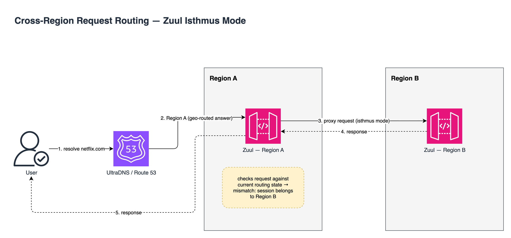
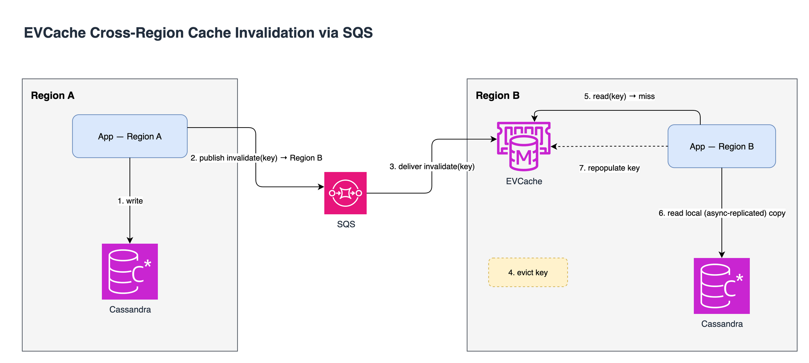
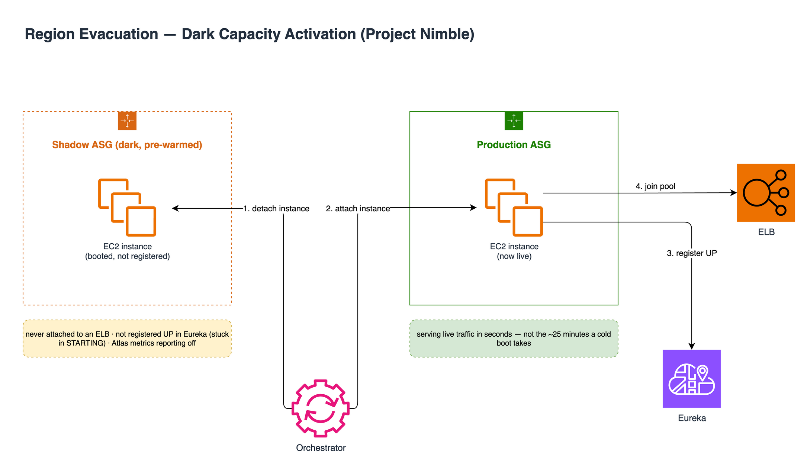

# Netflix: Multi-Region Active-Active Architecture

Netflix runs its streaming service out of three AWS regions at once, all serving live traffic at the same time. If one region goes down, the other two absorb the load. It's a capacity problem, not an outage.

## 1. The Problem

On Christmas Eve 2012, an AWS ELB failure in Netflix's US-EAST-1 region took down streaming for the US, Canada, and Latin America, while the UK, Ireland, and Nordic service, running in a separate region, kept working. It happened on one of the year's highest-traffic nights. That's the origin story.

The broader lesson showed up again in September 2015. A DynamoDB issue in US-EAST-1 cascaded into degradation across more than 20 other AWS services, over a six to eight hour window. No amount of redundancy inside a region protects you when the region itself is the failure domain.

Netflix's answer wasn't a warm standby that scales up after detecting a failure. It was to keep all three regions live, all the time, so evacuating one is just re-routing traffic to capacity that's already running.

## 2. Getting a Request to the Right Region

Two independent systems decide where a request goes, and they can disagree. That disagreement is the interesting part.

**DNS layer (Denominator):** Netflix layers two DNS providers. UltraDNS handles geo-directional routing: in steady state, traffic splits roughly 50/50 between US-EAST-1 and US-WEST-2 by geography. Route53 sits underneath it and is what actually gets repointed during an evacuation, because moving a CNAME in Route53 is more straightforward operationally than reconfiguring UltraDNS's territory groups. Denominator is the internal abstraction layer that lets Netflix drive both without hardcoding either vendor's API into the failover logic.

**Edge layer (Zuul):** DNS decisions are sticky. TTLs, caching, and long-lived sessions mean a request can physically land in a region that no longer "owns" that user. Zuul's job at that point is to notice and correct it:

- **Isthmus mode:** if a request lands in the wrong region relative to the current routing records, Zuul proxies it to the correct region transparently instead of erroring or forcing a client-side redirect.
- **Failover mode:** once a region has been marked as handling everyone (post-evacuation), Zuul stops trying to bounce "mis-routed" requests elsewhere and just serves them locally.
- **Traffic ceilings:** operators set a max request rate per region; anything above it gets a fast error response instead of being allowed to cascade into downstream services. This is deliberate load shedding, not a bug.

Zuul 2 itself is worth noting separately. It's built on Netty, async and non-blocking, and structured as inbound, endpoint, and outbound filter stages, where almost all the actual logic (auth, routing, the isthmus/failover behavior above) lives in filters rather than in the core. As of the 2018 write-up it ran more than 80 clusters in front of about 100 backend service clusters, handling over a million requests per second for 125 million members. It also does its own load-balancing math beyond simple round robin: origins report utilization via response headers, and Zuul picks between two candidate instances ("choice of two") weighing utilization, with cold instances getting reduced traffic during warm-up and bad instances getting temporarily blacklisted on elevated error rates.

## 3. Keeping Data Usable Locally in Every Region

The request-routing layer only works if every region can actually read and write its own local copy of the data. Otherwise "serve locally" would just mean "serve locally, slowly, over a cross-region database call."

**Cassandra:** writes replicate to other regions asynchronously, using `CL_LOCAL_QUORUM` (fast, waits only for local replicas) rather than a cross-region quorum. Netflix's own test wrote in one region and read in another 500ms later, under production-like load, and all records came back present. That ~500ms is a real, measured number, not a marketing rounding to "eventually consistent." One historical wrinkle: when EU-WEST-1 first launched, EU and Americas viewing history were kept as separate "data islands" rather than merged. Netflix later enhanced its Astyanax Cassandra client to write to both keyspaces in parallel and built tooling to reconcile the datasets, before eventually consolidating into a single replicated model.

**EVCache (the Memcached-based cache layer):** doesn't replicate cache values directly. It replicates *invalidations*. A write in Region A fires an SQS message telling Region B's EVCache cluster to evict that key. The next read in Region B misses, falls through to the local Cassandra replica, and repopulates the cache. This is a meaningfully different design than pushing the new value everywhere: it trades a guaranteed cache miss after every cross-region write for not having to ship potentially large payloads around just to keep caches warm.

## 4. Evacuating a Region: Project Nimble

The original (2013) evacuation process took about 50 minutes. The breakdown of where that time actually went is the useful part:

| Phase | Time | What was actually happening |
|---|---|---|
| Decide | ~5 min | Failovers were risky enough (lots of EC2-level mutations) that the decision itself was deliberately slow |
| Provision | 3-5 min | Netflix wasn't overprovisioned (diurnal traffic patterns), so figuring out how much capacity to add per service was non-trivial |
| Service startup | ~25 min | Boot instance, download deploy artifacts, establish backend connections, register with Eureka, apply Archaius config, register with the ELB |
| Traffic migration | 10+ min | Deliberately incremental via Zuul-to-Zuul tunneling, to let new instances absorb load gradually rather than all at once |
| DNS cutover | ~5 min | DNS propagates fast, but client-side TTLs meant most devices only picked up the change within ~5 minutes |

**25 of the 50 minutes was just servers booting.** Project Nimble, in 2018, targeted exactly that phase.

The mechanism is "dark capacity": shadow Auto Scaling Groups that are fully booted and running the application, but deliberately invisible to production.

- Never attached to a load balancer (separate ASG entirely).
- A custom library stops them from registering as `UP` in Eureka. They sit in a permanent `STARTING` state, so Ribbon (Netflix's client-side load balancer) never routes to them.
- Atlas metrics reporting is switched off, so they don't pollute dashboards or alerting.
- The base AMI auto-detects which ASG/region it's "really" destined for and sets environment variables accordingly. Netflix's phrase for this is that the dark instances are "blissfully unaware of their actual location" until activated.
- Spinnaker and Edda watch the real production ASGs and automatically clone every config/deploy change into the shadow ASGs, so dark capacity never drifts from what's actually running in prod.

When an evacuation triggers, an orchestrator uses AWS's instance detach/attach mechanism to move dark instances from the shadow ASG straight into the production ASG: no boot, no artifact download, no Eureka registration delay. It's closer to flipping a switch than starting a server.

Result: about 50 minutes down to about 8 minutes. Built by a team of two, over roughly six months, to roll out across all control-plane services. A useful reminder that pre-warming capacity is simple as an idea, but not as an integration project.

## 5. Demand Modeling: From a Single Metric to Per-Device Weighting

Knowing evacuation is fast doesn't tell you how much capacity to add to the surviving regions. Get that wrong and you either overspend or fall over anyway. Netflix's first model used a single proxy metric, **stream starts per second (SPS)**, to scale every microservice's capacity uniformly. That was a reasonable approximation back when services were more monolithic and demand tracked streaming events closely.

Two things broke it:

1. **Decomposition.** As the monolith split into function-specific microservices, each one's real demand stopped tracking SPS. Zuul's own shard-level data showed the SPS-implied demand diverging from actual demand throughout the day, by wildly different amounts service to service.
2. **Regional device mix.** Different regions skew toward different device types (mobile is bigger in South America; CE devices dominate elsewhere), and different devices don't stress every downstream service equally. The clearest example: DRM licensing is split by platform (CE, Android, iOS each use a different DRM system), so evacuating South American traffic northward doesn't scale CE and Android licensing demand by the same factor. SPS-uniform scaling has no way to represent that.

The replacement model, built bottom-up:

1. Each microservice picks its **own** demand metric (requests, connections, messages, whatever's real for it) self-service, pulled from Atlas.
2. Distributed tracing decomposes that service's regional demand by device type.
3. For each device type, Netflix computes an **evacuation scaling ratio** from historical evacuation traffic: normalize nominal traffic so its peak equals 1, then ratio = evacuation traffic ÷ nominal traffic for that device.
4. A service's overall scaling ratio is the demand-weighted sum across its device mix:

   **scaling ratio = Σ (device type % of traffic × that device's evacuation ratio)**

   Worked example from the source: a service that's 30% CE traffic (which scales 2x during evacuation), 40% Android (scales 2.5x), and 30% iOS (scales 1.5x) gets `(0.30 × 2) + (0.40 × 2.5) + (0.30 × 1.5) = 2.05x`. Pre-scale that service's capacity in the healthy regions to 205% of nominal before triggering the evacuation, not by whatever SPS says.

Netflix is explicit that this new model is also an approximation. It assumes all traffic for a given device type has the same "shape" (Android playback and Android logging scale identically), which isn't strictly true either. This isn't a solved problem so much as a better-fitting approximation, one that will need revisiting as the service graph keeps changing.

## 6. Proving It Actually Works

Three deliberately-run exercises test different failure shapes:

- **Chaos Kong:** simulates a whole region going away. AWS won't let you actually kill a region, so this is done via traffic steering, not a literal kill switch. It runs on a regular schedule: traffic is gradually redirected off the target region, redirects for any still-mis-routed users stay live, and the target has historically been held at 24+ hours of zero traffic before gradually rebalancing back to the normal split. Long enough to catch anything that only breaks after sustained absence, not just at the moment of cutover.
- **Chaos Gorilla:** the availability-zone-scale version of the same idea.
- **Split-brain:** deliberately severs connectivity between regions, without failing either one, so each region has to keep operating independently while replication queues back up. This is a harder case than a clean region failure because nothing has actually "died." The system has to decide to keep serving rather than treat the partition as an outage.

The real payoff showed up outside a drill. During the September 2015 US-EAST-1 DynamoDB incident (20+ dependent AWS services degraded, over a 6 to 8 hour window), Netflix's own account is a "brief availability blip" with no major impact, specifically because recurring Chaos Kong runs had already surfaced and fixed the weak points that would otherwise have broken during a real failover. There's also a non-drill example: a middle-tier system degraded in one region, the team triggered a real regional failover, quality of service recovered quickly by shifting to the healthy region, and the bad region was repaired while traffic gradually rebalanced back once it was fixed. That's the mechanism firing for an ordinary degradation, not just a headline-scale outage.

## 7. The Human Still in the Loop

Region evacuation is one of the "key choices" a CORE (Netflix's centralized reliability team) Incident Manager can make during an incident, according to Netflix's own write-up on its site reliability practice. That's about as far as the public material goes. The actual decision criteria, what signals, what thresholds, who else has to sign off, aren't disclosed anywhere I could find. Worth flagging as a real gap rather than papering over it with a plausible-sounding guess: Netflix chose to keep a human triggering this rather than fully automating it, but I don't actually know what that human is looking at when they decide.

## 8. Why These Trade-offs, Specifically

- **Async replication (`CL_LOCAL_QUORUM`) over cross-region quorum writes.** Every write stays fast and local; the cost is a real (measured: ~500ms in testing) window where another region can read stale data. Fine for viewing history and personalization signals; would not be fine for, say, payment state.
- **Full duplication in all three regions over a standby.** More standing infrastructure cost, but it converts an evacuation from "provision and warm up capacity" into "shift traffic to capacity that's already running," which is exactly the 42 minutes Project Nimble clawed back.
- **Pre-warmed dark capacity over pure autoscaling.** Deliberately wastes idle compute (instances doing nothing under normal conditions) to eliminate the slowest fixed cost in the old evacuation path.
- **Per-device demand weighting over a single proxy metric.** More bookkeeping (every service has to maintain its own demand breakdown), but SPS-uniform scaling was measurably wrong once services diverged from each other.
- **Human-triggered evacuation over full automation.** Slower by whatever it takes a person to notice and decide, in exchange for not letting an automated system evacuate a perfectly healthy region on a bad signal.

## 9. What Else Is Out There for This Problem

Grounding this in AWS's own DR framework, not just Netflix's framing of it, clarifies where active-active sits on a spectrum rather than being treated as a separate category:

| Strategy | What's actually running in the standby region | Recovery mechanic |
|---|---|---|
| Backup & restore | Nothing, just backups copied to another region | Rebuild infra from IaC (CloudFormation/CDK), restore data. Slowest RTO of the four. |
| Pilot light | Data only, e.g. Aurora global replication keeps a live read replica; compute is off | Scale up from pre-built AMIs when triggered |
| Warm standby | Minimal live capacity, handling a slice of real traffic at reduced scale | Scale the existing live deployment up to full production capacity |
| Multi-site active/active (Netflix's category) | Everything, at full scale, all the time | Just reroute traffic. Nothing to provision. |

Netflix sits at the expensive-but-fastest end on purpose. The single case that best explains why not to default there is **Google Cloud Spanner**, which solves the same "don't lose a region" problem at the data layer instead of the traffic-routing layer. A typical multi-region Spanner setup uses 5 replicas: 2 read-write replicas in each of 2 regions, plus a *witness* replica in a third region that votes on commits but holds no data. It exists purely to let a quorum form without paying for a third full data copy. Every write needs a majority of those 5 votes, which by construction means crossing a region boundary on every single write. That's the direct cost of Spanner's guarantee that regions can never disagree. Region-level leader failover is fast (Spanner claims under 10 seconds), and Spanner offsets the read-side cost with stale reads: a 15-second staleness bound lets the nearest replica answer locally without contacting the leader at all.

That's a genuinely different point on the trade-off curve from Netflix's design. Spanner pays a latency tax on every write so no region ever needs to be told it might be wrong. Netflix pays nothing extra per write and instead accepts that a region can briefly be wrong, betting, correctly for its workload, that viewing history and recommendations don't need the guarantee Spanner is selling.

## 10. Sources

- [Active-Active for Multi-Regional Resiliency](https://netflixtechblog.com/active-active-for-multi-regional-resiliency-c47719f6685b) — Netflix Technology Blog (Meshenberg, Gopalani, Kosewski)
- [Global Cloud — Active-Active and Beyond](https://netflixtechblog.com/global-cloud-active-active-and-beyond-a0fdfa2c3a45) — Netflix Technology Blog
- [Chaos Engineering Upgraded](https://netflixtechblog.com/chaos-engineering-upgraded-878d341f15fa) — Netflix Technology Blog (Basiri, Hochstein, Thosar, Rosenthal)
- [Open Sourcing Zuul 2](https://netflixtechblog.com/open-sourcing-zuul-2-82ea476cb2b3) — Netflix Technology Blog
- [Project Nimble: Region Evacuation Reimagined](https://netflixtechblog.com/project-nimble-region-evacuation-reimagined-d0d0568254d4) — Netflix Technology Blog (Kosewski, Ramanujam, Behnam, Blohowiak, Probst)
- [Evolving Regional Evacuation](https://netflixtechblog.com/evolving-regional-evacuation-69e6cc1d24c6) — Netflix Technology Blog (Niosha Behnam)
- [Keeping Customers Streaming — The Centralized Site Reliability Practice at Netflix](https://netflixtechblog.com/keeping-customers-streaming-the-centralized-site-reliability-practice-at-netflix-205cc37aa9fb) — Netflix Technology Blog
- [Demystifying Cloud Spanner multi-region configurations](https://cloud.google.com/blog/topics/developers-practitioners/demystifying-cloud-spanner-multi-region-configurations) — Google Cloud Blog
- [Disaster Recovery (DR) Architecture on AWS, Part I: Strategies for Recovery in the Cloud](https://aws.amazon.com/blogs/architecture/disaster-recovery-dr-architecture-on-aws-part-i-strategies-for-recovery-in-the-cloud/) — AWS Architecture Blog
- [Netflix Tops 325 Million Subscribers, Plans to Boost Content Spending 10% to $20 Billion in 2026](https://variety.com/2026/tv/news/netflix-q4-2025-financial-earnings-subscribers-1236635615/) — Variety, Q4 2025 earnings coverage
